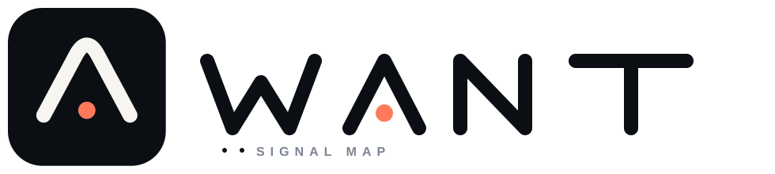
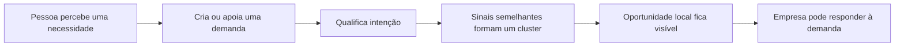
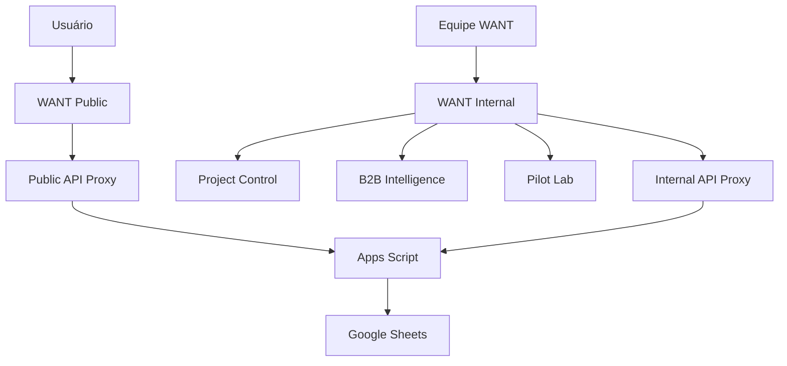
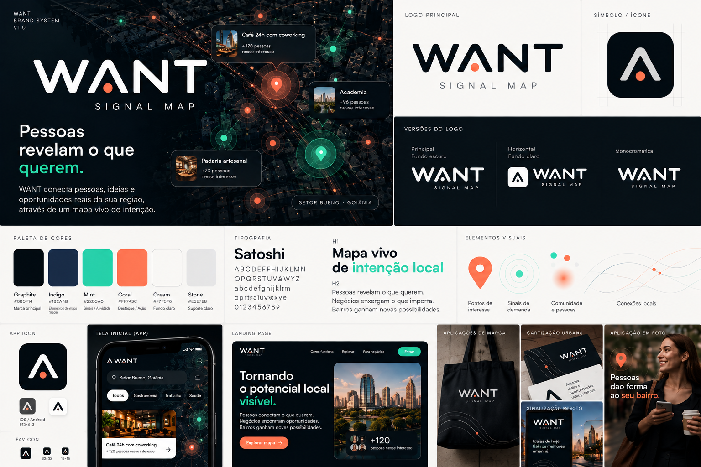
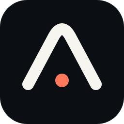

<p align="center">
  
</p>

<p align="center">
  <strong>O mapa do que as pessoas querem que exista.</strong><br/>
  Transformando desejos locais dispersos em sinais de demanda visíveis, compartilháveis e acionáveis.
</p>

<p align="center">
  
  
  
</p>

---

## Visão

**WANT** é uma plataforma de inteligência de demanda local.

Em vez de perguntar apenas **“o que existe aqui?”**, o WANT registra e agrega sinais para responder:

> **“o que deveria existir aqui?”**

Cada intenção adiciona contexto suficiente para transformar um desejo solto em um sinal econômico e territorial útil.

<table>
<tr>
<td width="25%" valign="top"><strong>📍 Onde</strong><br/>bairro, região e raio máximo</td>
<td width="25%" valign="top"><strong>💬 O quê</strong><br/>necessidade, categoria e atributos</td>
<td width="25%" valign="top"><strong>⏱️ Como</strong><br/>frequência, momento e padrão de uso</td>
<td width="25%" valign="top"><strong>💳 Quanto</strong><br/>preço, ticket e força de intenção</td>
</tr>
</table>

---

## Demand Graph

```text
quem quer + o quê + onde + quando + frequência + preço + força de intenção
```

O produto transforma esses sinais em **clusters de demanda**.



---

## Como o produto funciona

<table>
<tr>
<td width="33%" valign="top">

### 01 · Declare

A pessoa registra algo que gostaria que existisse perto dela.

**Exemplo**  
“Café 24h com coworking no Setor Marista.”

</td>
<td width="33%" valign="top">

### 02 · Reforce

Outras pessoas encontram o sinal e registram a própria intenção.

O cluster ganha contexto de:
- frequência
- raio
- faixa de preço
- força de intenção

</td>
<td width="33%" valign="top">

### 03 · Revele

A soma dos sinais mostra onde existe uma oportunidade local mais consistente.

O foco não é opinião.  
É **intenção contextualizada**.

</td>
</tr>
</table>

---

## Experiência atual

### Público

A experiência pública é voltada apenas para consumidores e respondentes.

```text
/               Landing pública
/landing        Experiência consumer
?cluster=...    Página pública de cada cluster
```

Permite:

- criar uma demanda;
- explorar sinais existentes;
- apoiar uma demanda;
- compartilhar um cluster;
- registrar eventos necessários ao experimento.

### Interno

As ferramentas operacionais ficam em um pacote separado:

```text
/control/       Project Control
/b2b/           B2B Intelligence
/pilot/         Pilot Lab
```

> O ambiente interno deve ser publicado em projeto/domínio separado e protegido.

---

## Arquitetura



### Trust boundary

| Superfície | Público | Objetivo |
| --- | :---: | --- |
| Landing / Clusters | ✅ | Coletar e agregar demanda |
| Project Control | ❌ | Operação e gestão do projeto |
| B2B Intelligence | ❌ | Leitura comercial das oportunidades |
| Pilot Lab | ❌ | Acompanhar experimentos e métricas |

---

## Identidade

<p align="center">
  
</p>

A linguagem visual combina:

**Signal Map** como direção dominante  
+  
**Civic Pulse** como camada humana controlada

<table>
<tr>
<td align="center"><strong>Graphite</strong><br/><code>#0B0F14</code></td>
<td align="center"><strong>Indigo</strong><br/><code>#1B2A4B</code></td>
<td align="center"><strong>Mint</strong><br/><code>#22D3A0</code></td>
<td align="center"><strong>Coral</strong><br/><code>#FF7A5C</code></td>
<td align="center"><strong>Cream</strong><br/><code>#F7F5F0</code></td>
</tr>
</table>

### Ideia central da marca

> **Um sinal local ficando visível.**

---

## Piloto

**Geografia inicial**
- Setor Bueno
- Setor Marista
- Goiânia

**Categorias prioritárias**
- Alimentação & Conveniência
- Fitness & Bem-estar
- Mobilidade & Conveniência Automotiva

**North Star**
> **Demandas atendidas**

**Magic event**
> “Queria que isso existisse” → “Agora existe.”

---

## Modelo de oportunidade

```mermaid
flowchart LR
    P0["P0 · Sinal"] --> P1["P1 · Cluster"]
    P1 --> P2["P2 · Qualificado"]
    P2 --> P3["P3 · Reality Checked"]
    P3 --> P4["P4 · Opportunity Ready"]
    P4 --> P5["P5 · Matched"]
    P5 --> P6["P6 · Offer Live"]
    P6 --> P7["P7 · Commitment"]
    P7 --> P8["P8 · Closed"]
    P8 --> P9["P9 · Fulfilled"]
```



---

## Modelo de negócio

O consumidor participa gratuitamente.

A monetização planejada acontece no lado B2B por meio de:

- acesso empresarial a demanda agregada qualificada;
- estudos e oportunidades locais;
- success fee em negócios efetivamente fechados ou convertidos.

**Não faz parte do modelo:**
- venda de PII bruta;
- monetização de missões comunitárias;
- cobrança do consumidor para registrar demanda.

---

## Estrutura do repositório

```text
want/
├── public/                 # experiência pública
│   ├── landing/
│   ├── api/
│   └── brand/
│
├── internal/               # operação privada
│   ├── control/
│   ├── b2b/
│   ├── pilot/
│   ├── docs/
│   └── brand/
│
├── brand/
│   ├── reference/          # direção visual aprovada
│   └── concepts/           # explorações visuais
│
├── docs/                   # arquitetura e decisões atuais
├── releases/               # pacotes preservados
├── PROJECT_STATE.md
└── README.md
```

---

## Release atual

### v6.8

A v6.8 formaliza a separação entre:

**WANT Public**  
Experiência consumer-only para respondentes.

**WANT Internal**  
Ambiente operacional com gestão, B2B e Pilot Lab.

Pacotes preservados:

- [WANT Public v6.8](./releases/WANT_Public_v6_8.zip)
- [WANT Internal v6.8](./releases/WANT_Internal_v6_8.zip)

---

## Segurança

O repositório **não deve conter secrets reais**.

Variáveis como:

```text
APPS_SCRIPT_TOKEN
SHARED_TOKEN
APPS_SCRIPT_URL
```

devem existir somente no ambiente de execução.

A experiência pública usa um proxy reduzido, limitado às operações necessárias ao consumidor.

---

## Estado atual

| Frente | Estado |
| --- | --- |
| Geografia piloto | ✅ Definida |
| Categorias iniciais | ✅ Definidas |
| ICP B2B | ✅ Definido |
| Taxonomia de demanda | ✅ Definida |
| Landing + clusters | ✅ Funcionais |
| Tracking E01–E03 | ✅ Instrumentado |
| Brand System | ✅ Aplicado |
| Separação Public / Internal | ✅ Implementada |
| E01–E03 com usuários reais | ⏸️ Aguardando recrutamento |
| Pesquisa comercial B2B | 🔄 Próxima frente |

---

<p align="center">
  
</p>

<p align="center">
  <strong>WANT</strong><br/>
  O mapa do que as pessoas querem que exista.
</p>
